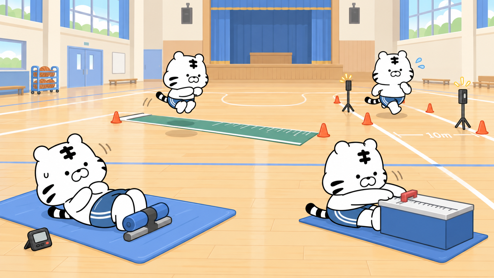

# AI 체력 코치

> 체력측정 결과를 입력하면 또래 기준에서 현재 위치를 보여주고, 부족한 체력요인에 맞는 국민체력100 운동 자료를 찾아주는 로컬 웹 서비스

국민체력100에서 측정을 받고도 “그래서 어떤 운동을 해야 하지?”라는 질문은 그대로 남습니다. AI 체력 코치는 측정 결과를 해석하는 일부터 운동을 고르고, 관련 질문에 근거를 붙여 답하는 과정까지 한 화면에서 이어지도록 만든 프로젝트입니다.

2026년 국민체육진흥공단 공공데이터 활용 경진대회를 준비하며 4명이 약 5주 동안 기획, 데이터 분석, 서비스 구현, 검증을 함께 진행했습니다. 대회 제출용 시제품에서 멈추지 않고 다른 PC에서도 다시 실행하고 결과를 확인할 수 있는 Windows 로컬 패키지까지 만들었습니다.



## 이 프로젝트에서 해결한 것

- 센터 측정값과 홈 측정값을 같은 등급처럼 섞지 않고 각각의 기준으로 보여줍니다.
- 성별·연령별 원시 측정 기록으로 또래 백분위를 계산해 체력요인별 강점과 보완점을 정리합니다.
- 연령, BMI, 운동 목적, 장소, 장비를 실제 공공데이터 필드와 연결해 운동을 추천합니다.
- 답변에 사용한 공단 자료를 함께 보여주고, 자료에 없는 수치·운동 효과·사용자 기록은 만들지 않도록 응답을 검증합니다.
- 사용자와 프로필이 바뀌어도 이전 사람의 측정 기록이나 대화 맥락이 섞이지 않도록 세션을 분리했습니다.

## 서비스 흐름

```text
프로필 입력
   ↓
센터 측정 또는 홈 측정 선택
   ↓
또래 백분위와 체력요인 리포트
   ↓
연령·BMI·목적·장소·장비 기반 운동 추천
   ↓
국민체력100 공식 영상과 출처 확인
   ↓
현재 프로필과 검색 근거를 사용한 코칭 대화
```

센터 측정은 점 백분위로, 홈 측정은 오차를 고려한 구간으로 표시합니다. 인증등급, 홈 측정 결과, 영상 난이도는 서로 다른 척도이므로 임의로 변환하지 않았습니다. 통증이나 질환이 언급된 경우에도 원문에 직접 근거가 없으면 일반 운동을 맞춤 처방처럼 보여주지 않습니다.

## 데이터와 모델

| 구분 | 프로젝트에서 사용한 방식 |
|---|---|
| 체력측정 및 운동처방 종합 데이터 | 성별·연령별 백분위 규준과 실제 처방 사례 확인 |
| 체력인증센터 측정결과 | 또래 비교와 체력 프로파일 생성 |
| 국민연령별 추천운동 정보 | 연령·성별·BMI·상장 구분별 준비/본/마무리 운동 규칙 구성 |
| 체력측정별 운동처방결과 | 비슷한 조건의 실제 처방 조합 참고 |
| 국민체력100 동영상 정보 | 운동 방법, 목적, 장소, 장비, 공식 영상 연결 |
| 체력인증센터 측정건수 | 센터 연계 기능을 위한 보조 데이터 |

최종 로컬 패키지는 원본 4,355,013행을 정리해 RAG 문서 160,461건, 센터 백분위 점수 셀 52,049개, 연령·성별·BMI 기반 추천 규칙 5,040행을 사용합니다. 생성 모델은 Qwen3-4B Q4, 임베딩 모델은 `ko-sroberta-multitask`를 로컬에서 실행하도록 구성했습니다.

## 검증 결과

“화면이 열린다”를 완료 기준으로 삼지 않았습니다. 프론트와 백엔드의 계약, 실제 API 응답, 브라우저 화면, 사용자 분리, 검색 경로를 따로 확인했습니다.

| 확인 항목 | 결과 |
|---|---:|
| 공식 평가 세트 | 145/145 HTTP·경로 통과 |
| RAG 대상 검색 | 80/80 Chroma 경로 사용 |
| 근거 제한 규칙 | R5 80/80, R8 65/65, R11 6/6 |
| 관련 단위·계약 테스트 | 54/54 통과 |
| 프론트 통합 계약 | 38/38 통과 |
| 백엔드 인증·기록·대화 계약 | 36/36 통과 |
| 3인 블라인드 평가 | 12/12 다수결 PASS, 10건 만장일치 |

평가 수치가 만들어진 조건과 남은 한계는 [작업 기록과 검증 결과](docs/PORTFOLIO.md)에 함께 적었습니다.

## 저장소 구성

팀원용 경로별 안내는 [저장소 구조 안내](docs/REPOSITORY_STRUCTURE.md)를 참고합니다.

- `apps/web`: P3 반응형 시연 프론트엔드
- `apps/api`: Python 기반 코칭·RAG·측정 로직, 테스트, 서버 기동 스크립트와 프롬프트
- `apps/api/artifacts`: 백분위 조회용 공개 규준 DB (그 외 생성물은 Git 제외)
- `data/reference`: 서비스가 참조하는 소형 규칙표·정규화 결과·영상 메타데이터
- `data/scripts`: RAG 원문 DB 생성 노트북
- `docs`: 기획, 회의, 설계 기준, EDA, 공모전 자료
- `docs/frontend`: 프론트엔드 설계·검증 문서
- `docs/specifications`: 백엔드 API 계약 문서
- `evaluation`: 평가 계획 v1~v3와 검토자 배포 자료

## 시작 전 확인

이 저장소에는 대용량 원본 공공데이터, 로컬 LLM 모델, Chroma 인덱스, 사용자 DB를 넣지 않습니다. 각각의 획득·생성 절차는 [data/README.md](data/README.md)에 기록합니다.

## 실행 환경

백엔드는 Python 3.10~3.12 환경을 기준으로 합니다. 이 저장소는 포트폴리오와 코드 검토를 위한 공개본이므로 대용량 모델과 인덱스는 별도로 배치해야 합니다. Windows 원클릭 배포 패키지는 모델 재배포 조건과 파일 크기 때문에 저장소에 넣지 않았습니다.

```powershell
cd apps\api
python -m venv .venv
.\.venv\Scripts\python.exe -m pip install -r requirements.txt
```

## 현재 포함 범위

- 프론트엔드: 반응형 리포트·추천·챗봇 화면
- 백엔드: Python 소스·테스트·기동 스크립트·챗봇 시스템 프롬프트
- 데이터: 규준·측정 규칙·영상 메타데이터·BMI 기준, 그리고 백분위 조회용 공개 규준 DB

## 필수 외부 자산

| 자산 | 크기 | 배치 위치 |
|---|---:|---|
| Qwen3-4B-Q4_K_M.gguf | 2.5GB | `apps/api/models/` |
| Chroma 인덱스 | 887MB | `AI_FITNESS_CHROMA_DIR` |
| rag_documents.sqlite | 223MB | `apps/api/artifacts/` |

외부 자산의 배포 경로는 공개 저장소에 포함하지 않습니다.

## 데이터 출처·라이선스

- 체력측정 및 운동처방 종합 데이터(문화빅데이터플랫폼, 2022.01~2026.07): 백분위 규준과 표본 검증에 사용
- 국민체력100 체력측정결과·운동처방·동영상 정보(국민체육진흥공단): 측정 항목, 처방 구조 및 영상 메타데이터에 사용
- 국민연령별 추천운동 정보: 연령·BMI 기반 추천 규칙에 사용
- 국민체력100 인증기준: 공식 기준 참조용으로만 사용하며, 서비스는 공식 인증등급을 발급하지 않음

각 원천 데이터의 공공누리 유형과 재배포 조건은 제공처 상세 페이지에서 확인해야 합니다. 서비스 결과는 운동 참고 정보이며 의료 진단이나 국민체력100 공식 인증등급을 대신하지 않습니다.

2026 국민체육진흥공단 공공데이터 활용 경진대회 — 서비스(웹·앱) 개발 부문 / 접수 마감 2026-10-02
